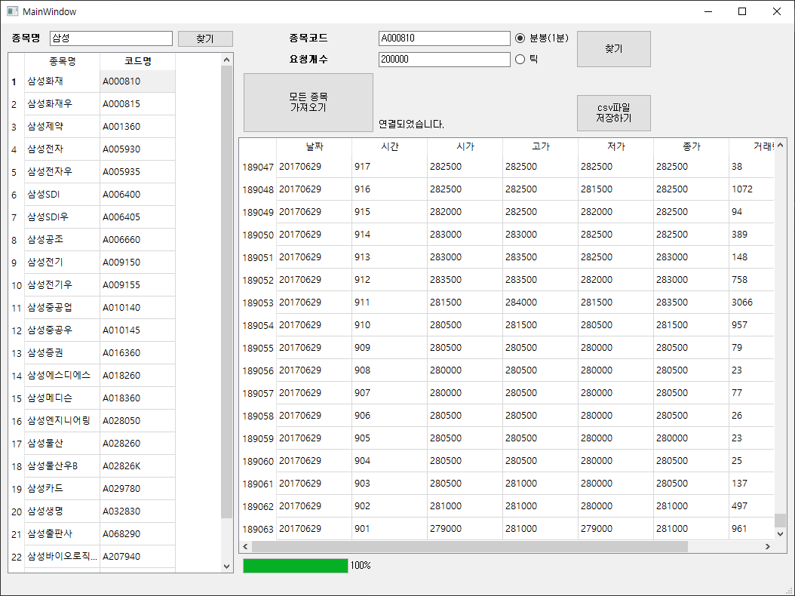
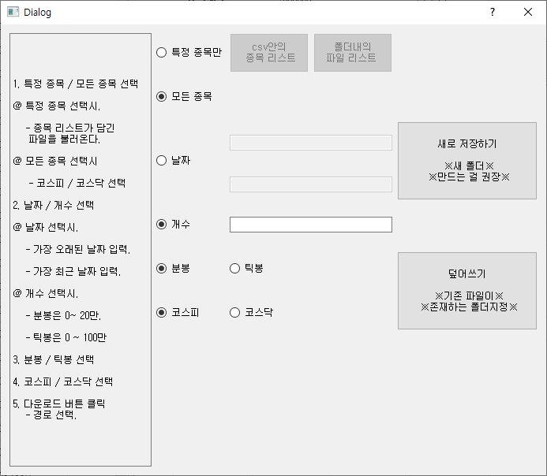
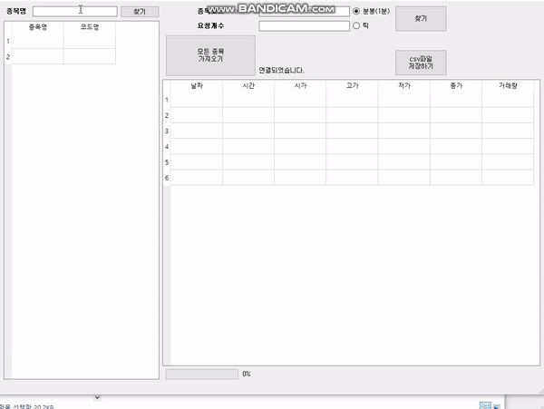
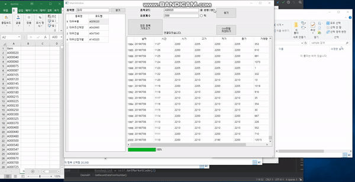
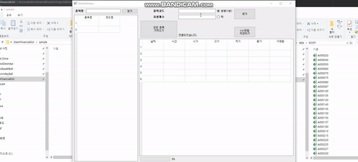
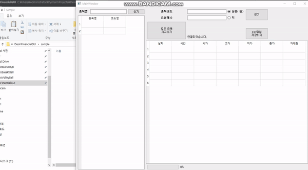

# DesinFinancialGUI
대신증권API를 GUI로 데이터 받아와서 csv로 저장하기 - python

# 조건

대신증권API를 사용하기 위해서는 공인인증서가 필요하고, 대신증권의 계좌가 있어야합니다.

그리고 대신증권 홈페이지에서 CYBOS PLUS 를 다운받으시고 로그인을 한 상태에서 프로그램을 실행시켜야 합니다.

지금까지의 과정은 https://wikidocs.net/5227 여기에 자세히 알려주니 참고하시면 됩니다.

# 개요

종목코드와 개수를 입력함으로써 데이터를 받아와서 csv파일로 저장합니다.

또한 특정종목이나, 모든 종목을 한번에 데이터를 받아와서 저장할 수 있습니다.

기존에 있던 데이터에 덮어쓸 수 있습니다. 

**분봉데이터는 최대 2년전까지 데이터를 받아올 수 있으며, 개수로 입력할 때는 대략 20만이 최대입니다.

**틱봉데이터는 최대 2달전까지 받아오는 듯 하며, 많게는 80만까지도 받아오는 걸로 확인했습니다.

**날짜를 입력하면서 틱봉데이터는 가져올 수 없습니다. 

**하루치 데이터만 가져올려면 같은 날짜를 입력하시면 됩니다. 

# 사용방법 

